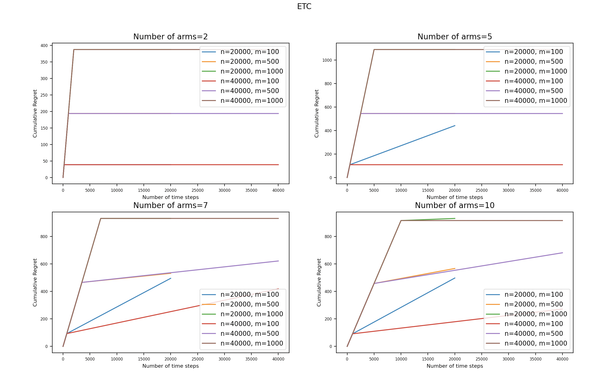
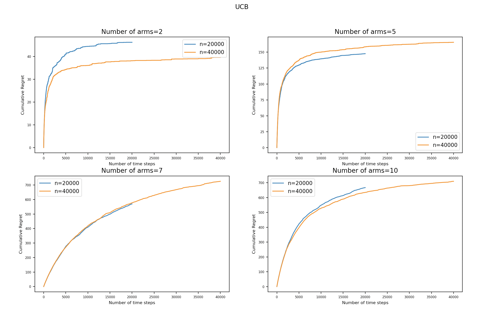
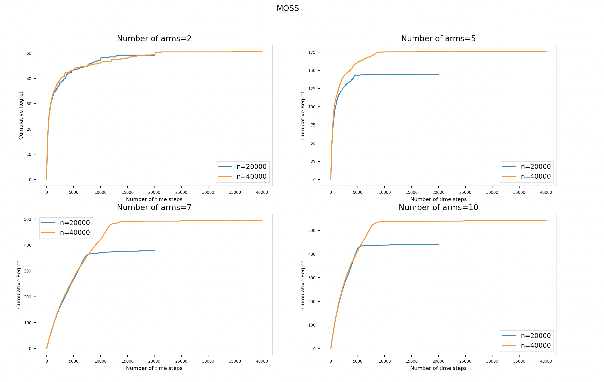
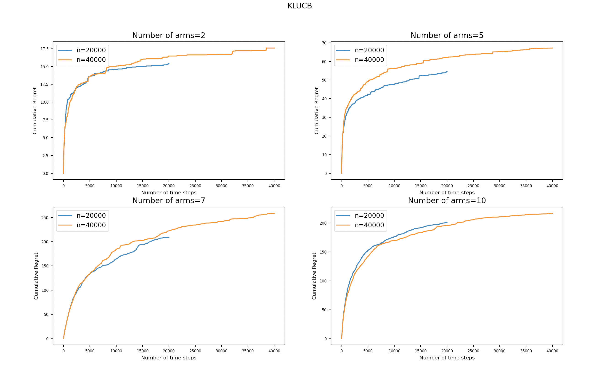

# bandit-algorithms
A short implementation of bandit algorithms - ETC, UCB, MOSS and KL-UCB.

**How to run?**

For example to run UCB algorithm, simply run `python main.py --algo ucb`

**Explore-Then-Commit (ETC)**

**Upper Confidence Bound (Basic UCB)**

**Minimax-Optimal Strategy in Stochastic Multi Armed Bandits (MOSS)**

**Kullback-Leibler Upper Confidence Bound (KL-UCB)**

